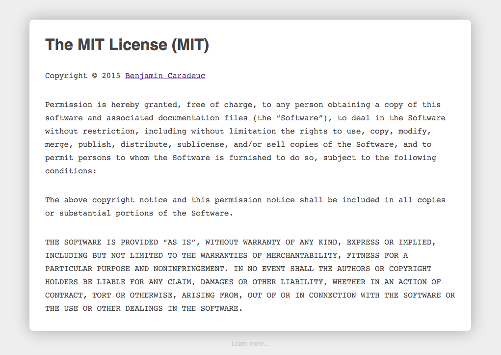

# MIT License for everyone

## My problem

A little bit bored from having to add a license to each of my project, README, etc...

## My solution

I decided to create a github page for the MIT license (which I use for a lot of my projects) filled with my information.

But when you do that and know that you only have to change your name and optionaly provide a link, you tell yourself, "What else???".

As a good developper, you want your creation to be usefull for other people!

This is what I did :

http://benavern.github.io/MIT/

## HowTo

To personalize it, you just have to add some search-like information in the url's hash

* `name` :  yours or your companies
* `link` : (optional) a URL or mailto link to give the visitor a chance to contact you

## Demo

Take me, my name is Benjamin Caradeuc and my personal website (where you can find how to contact me) is located at http://caradeuc.info/

The URL will be :

[http://benavern.github.io/MIT#name=Benjamin Caradeuc&link=http://caradeuc.info/](http://benavern.github.io/MIT#name=Benjamin Caradeuc&link=http://caradeuc.info/)

## License

[MIT](http://benavern.github.io/MIT#name=Benjamin Caradeuc&link=http://caradeuc.info/)
